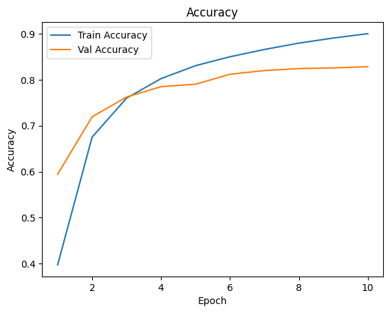

# CNN-captcha-recognition-for-Luogu

## 介绍

自动识别并填写洛谷提交时的验证码

简单的深度学习课程作业任务

最终测试集准确率在94.8%左右

~~(买不起服务器所以只好部署在本地了)~~
感谢 [同学](https://github.com/Hanserneko) 的支援,已经在服务器部署了

## 使用

1. 首先，确保你有 [TamperMonkey](https://www.tampermonkey.net/) 插件。
2. 下载本仓库的 [user.js](./user.js) 。
3. 在浏览器的右上角找到扩展——篡改猴——添加脚本。
4. 删除原有内容，将user.js拖到网页的编辑器中。
5. ctrl + s 保存。
6. ~~在本地运行 [app.py](./app.py)。什么？服务器？以后再说...~~
   (已经不需要这一步啦)

## 具体内容

### 数据集
数据集全部来自https://github.com/langningchen/luoguCaptcha/tree/main/data

非常感谢大佬的数据集，当我在一片茫茫大海中到处寻找数据集的时候，他仓库的出现仿佛黑暗中的一道光

### 训练

一开始使用的 [非常经典的卷积池化三层结构](./CNNtrain.ipynb)

  1. 三层卷积 + 池化
  2. 展平 + 全连接
  3. 四路输出头

做完之后发现距离验收还有一段时间，于是又简单地改进出了一个使用 [ResNet预训练模型](./RN_train.ipynb) 的，结果测试集准确率达到了惊人的94.8%.
(我觉得我作为一个人类也达不到那么高)

### 模型
仓库中有两个模型参数，[CNN83](CNN83.pth) 是经典CNN的产物，测试集准确率约为82%，[ResNet95](ResNet95.pth) 则为使用了ResNet的产物，准确率约为95%

### 预测

在 [predict.ipynb](predict.ipynb)，读取模型后可以在洛谷抓图进行预测。

### 误差和准确率

### 服务器

一开始需要使用 [app.py](app.py) 在本地运行，才可进行预测服务，现在已经部署在服务器，所以仅需要安装 [user.js](user.js) 便可以正常运行。